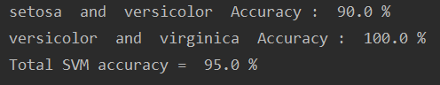

# Iris_Classfying_SVM
Support Vector Machine without any ML libraries. It classifies Iris data set.

Requirements
---------------------
All requirements are only 
* ```numpy```
* ```pandas```
* ```matplolib```

Run
---------------------
Make sure that "iris_dataset.csv" is located in the current directory. Then
<pre><code> python3 svm.py </pre></code>

Result
---------------------
 </img>
